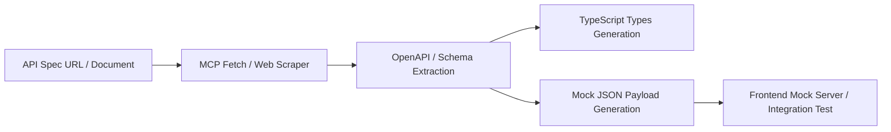

# 🔗 API Mocking & Contract Tool (MCP) Skill

## 1. 개요 (Overview)
본 스킬은 `modelcontextprotocol/servers` (Fetch / Web Scraper) 기반의 MCP 서버 연동을 통해 백엔드 API 명세(Swagger / OpenAPI / REST docs)를 스크래핑하고, 프론트엔드 통합 테스트 및 독립적 개발을 위한 타입 정의 및 Mock JSON 페이로드를 자동 생성합니다.

---

## 2. 작업 흐름 (Workflow)

---

## 3. 핵심 규칙 (Rules & Implementation)

### 1. API 스크래핑 및 스키마 추출
* MCP tools (`read_url_content`, `fetch`)를 활용해 Target API 문서 URL 또는 Swagger JSON 엔드포인트를 수집합니다.
* 파싱된 엔드포인트의 `requestBody`, `responseBody`, `pathParameters`를 추출합니다.

### 2. Mock JSON 데이터 자동 생성
* 스키마 표준에 맞춘 샘플 데이터를 생성합니다.
* 하드코딩된 dummy 값 대신 실제 데이터 타입에 부합하는 가상 데이터(UUID, ISO Timestamp, HSL Color string 등)를 구성합니다.

### 3. 디커플링(Decoupling) 개발 지원
* 백엔드 API 구현 전이라도 모크 계약(Mock Contract) 체결을 통해 프론트엔드 UI 개발을 병행 가능하도록 지원합니다.
