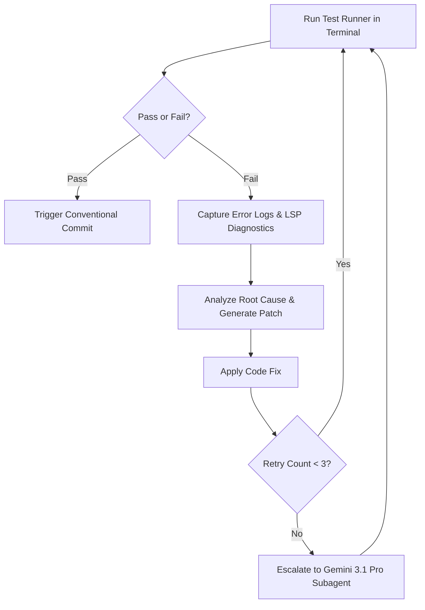

# 🛡️ Self-Healing Test Runner Skill

## 1. 개요 (Overview)
본 스킬은 integrated terminal 및 LSP(Language Server Protocol) 진단 기능을 활용하여, 코드 수정 후 자동으로 테스트 슈트(`pytest`, `npm test` 등)를 실행하고, 테스트 실패 시 오류 로그를 수집하여 사람의 개입 없이 스스로 수정 및 재검증하는 **Self-Healing Coding Agent Loop**를 수행합니다.

---

## 2. 자가 치유 피드백 루프 (Self-Healing Feedback Loop)

---

## 3. 세부 실행 규칙 (Execution Rules)

### 1. 테스트 실행 및 실행 결과 수집
* Terminal 명령을 사용하여 프로젝트의 검증 테스트를 실행합니다.
* 테스트 실패 발생 시 전체 터미널 출력 중 **Fail 이유, Stack Trace, 해당 파일 경로 및 라인 번호**를 정확히 파싱합니다.

### 2. 원인 진단 및 자가 수정 (Self-Fix)
* 파싱된 에러 원인과 LSP 경고 메시지를 종합하여 최소 침습적(Minimalistic) 정밀 패치를 생성 및 적용합니다.
* 적용 후 즉시 테스트를 다시 수행하여 버그가 해결되었는지 재검증합니다.

### 3. 실패 에스컬레이션 정책 (Escalation Threshold)
* 동일 테스트가 **3회 연속 실패**할 경우, 즉시 `task-orchestration-token-diet` 스킬에 의거하여 `Gemini 3.1 Pro` 모델 기반 에이전트로 에스컬레이션합니다.
* 에스컬레이션된 `Gemini 3.1 Pro` 에이전트가 문제를 해결하고 테스트가 통과되면, 해당 Pro 에이전트 스레드는 즉시 종료(`kill`) 처리하고 `Gemini 3.5 Flash`로 복귀합니다.
